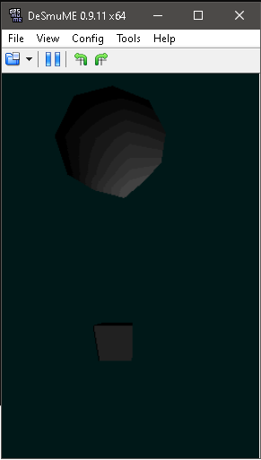

NTR/TWL SDK: TGDS1.65

master: Development branch. Use TGDS1.65: branch for stable features.

This is the ToolchainGenericDS for NintendoDS project:

1.	Compile Toolchain:
To compile this project you will need to follow the steps at https://github.com/cotodevel/toolchaingenericds :
Then simply extract the project somewhere.

2.	Compile this project: 
Open msys, through msys commands head to the directory your extracted this project.
Then write:
make clean <enter>
make <enter>

After compiling, run the example in NDS. 

Project Specific description: TGDS Project + OpenGL frontend for both WIN32 and NintendoDS. 
Provides a minimal API for rendering a 3D scene (of any model standard to OpenGL and/or native GX DisplayList payload) and manipulating camera.
Useful for porting OpenGL 3D games into NintendoDS, where you require the game engine to run through Visual Studio 2012 WIN32 debugger on the fly.

Usage:

D-PAD Left: Move camera left
D-PAD Right: Move camera right
D-PAD Up: Move camera closer
D-PAD Down: Move camera further

A: Enable background music
B: Enable background music

Key L: Run ToolchainGenericDS-multiboot
Key R: Swap screens

Note: TGDSProject3D offers Custom ARM7 VRAM Core providing all necessary services for wifi + soundstream + homebrew loader 

____Remoteboot____
Also, it's recommended to use the remoteboot feature. It allows to send the current TGDS Project over wifi removing the necessity
to take out the SD card repeteadly and thus, causing it to wear out and to break the SD slot of your unit.

Usage:
- Make sure the wifi settings in the NintendoDS are properly set up, so you're already able to connect to internet from it.

- Get a copy of ToolchainGenericDS-multiboot: http://github.com/cotodevel/ToolchainGenericDS-multiboot/archive/TGDS1.65.zip
Follow the instructions there and get either the TWL or NTR version. Make sure you update the computer IP address used to build TGDS Projects, 
in the file: toolchaingenericds-multiboot-config.txt of said repository before moving it into SD card.

For example if you're running NTR mode (say, a DS Lite), you'll need ToolchainGenericDS-multiboot.nds, tgds_multiboot_payload_ntr.bin
and toolchaingenericds-multiboot-config.txt (update here, the computer's IP you use to build TGDS Projects) then move all of them to root SD card directory.

- Build the TGDS Project as you'd normally would, and run these commands from the shell.
<make clean>
<make>

- Then if you're on NTR mode:
<remoteboot ntr_mode computer_ip_address>

- Or if you're on TWL mode:
<remoteboot twl_mode computer_ip_address>

- And finally boot ToolchainGenericDS-multiboot, and press (X), wait a few seconds and TGDS Project should boot remotely.
  After that, everytime you want to remoteboot a TGDS Project, repeat the last 2 steps. ;-)

Note: 
- /release folder has the latest binary precompiled for your convenience. Copy all contents from either /arm7dldi-ntr or /arm7dldi-twl folder depending on NintendoDS model.
- Preferably, use toolchaingenericds-multiboot and load snakeGL from there. It's guaranteed to work.

Latest stable release:
http://github.com/cotodevel/tgdsproject3d/archive/TGDS1.65.zip

OST: -Ron Jarzombek - She Blotted Me With Science

Coto